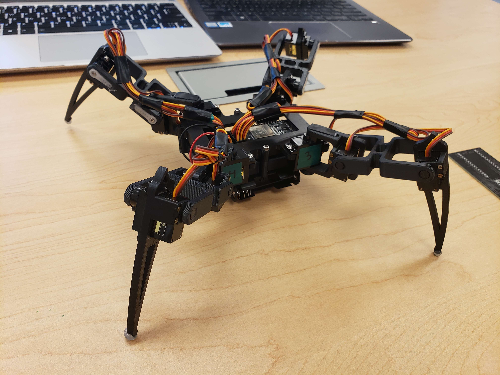
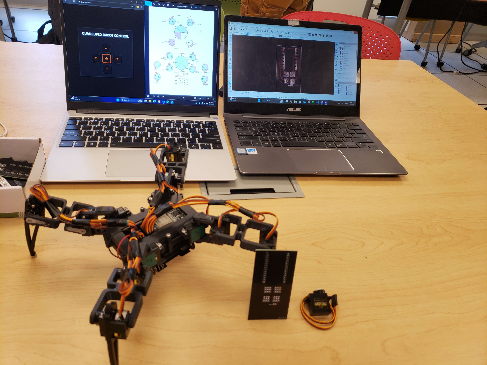
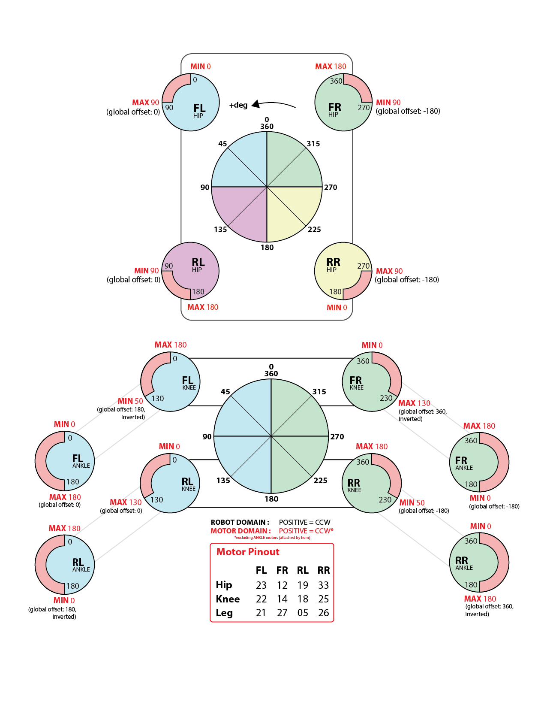

# 🕷️ Quadruped Spider Robot

A fully 3D-printed, C++-controlled quadruped robot built from scratch using SG90 servos and a custom PCB. Controlled via a web browser interface, this project served as the final project for our robotics course — and earned the **highest score in the class**.

---

## 🎯 Project Overview

This robot is a four-legged spider-like walker designed for remote control through a browser interface. It demonstrates full-stack integration across:

- 🦾 **Mechanical Design** – Fully 3D-printed body and leg system with articulated joints
- 🧠 **Embedded Systems** – Low-level servo control written in C++
- 🌐 **Web Interface** – Real-time browser-based control over Wi-Fi
- ⚡ **Custom Electronics** – Custom-designed PCB for servo power and logic

---

## 🛠️ Technologies Used

- **C++** (Arduino-compatible)
- **ESP32 Microcontroller**
- **SG90 Micro Servos** (3 per leg × 4 legs = 12 servos)
- **Custom PCB** for servo distribution and control
- **Web Server Interface** hosted on the robot (ESPAsyncWebServer)
- **3D Printed Chassis** (Designed in Fusion 360/ Printed on Prusa 4)

---

## 📸 Project Highlights

---

## 🧠 Features

- Browser-based joystick control (no app needed)
- Smooth gait motion via inverse kinematics
- Real-time feedback and status over Wi-Fi
- Modular leg design for quick maintenance
- Compact and portable custom PCB powering all logic and servos

---

## 🚀 How It Works

1. ESP32 boots and hosts a local web server
2. User connects to the robot's hotspot or local network
3. Web interface sends control commands (via WebSockets or HTTP)
4. C++ firmware parses commands and drives 12 SG90 servos
5. Robot moves based on chosen gait (e.g., crawl, trot)

---

## 🏆 Recognition

> ✅ **Scored the highest grade in the class**  
> ✅ Praised for mechanical design, control system, and software integration

---

### 🧭 Custom Kinematics Diagram

We designed a custom control diagram to convert **local servo angles** into **global, human-readable angles**. This abstraction simplified the programming of leg movement and gait coordination, allowing us to control the quadruped in an intuitive and modular way.

This system made it easier to:
- Visualize leg orientation in 3D space
- Translate desired poses into servo commands
- Create and tweak gaits like crawl, trot, and pivot with minimal code changes

